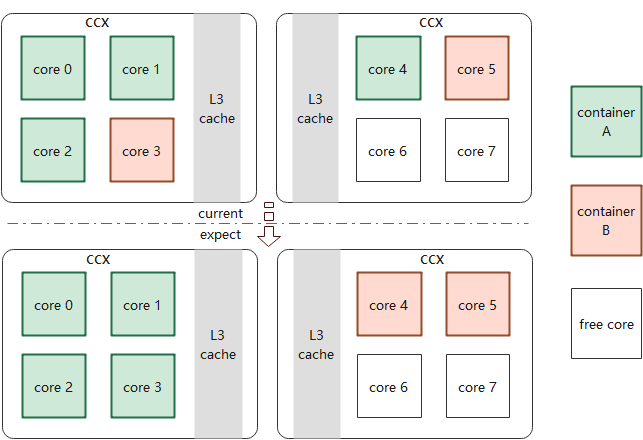
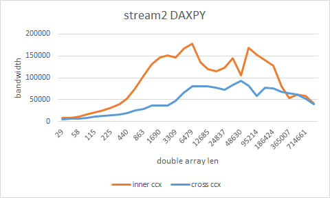

# KEP-2621: Add LLC Affinity to CPU manager

<!-- toc -->
- [Release Signoff Checklist](#release-signoff-checklist)
- [Summary](#summary)
- [Motivation](#motivation)
  - [Goals](#goals)
  - [Future Work](#future-work)
- [Proposal](#proposal)
  - [User Stories (Optional)](#user-stories-optional)
  - [Notes/Constraints/Caveats (Optional)](#notesconstraintscaveats-optional)
  - [Risks and Mitigations](#risks-and-mitigations)
- [Design Details](#design-details)
  - [Test Plan](#test-plan)
  - [Graduation Criteria](#graduation-criteria)
  - [Upgrade / Downgrade Strategy](#upgrade--downgrade-strategy)
  - [Version Skew Strategy](#version-skew-strategy)
- [Production Readiness Review Questionnaire](#production-readiness-review-questionnaire)
  - [Feature Enablement and Rollback](#feature-enablement-and-rollback)
  - [Rollout, Upgrade and Rollback Planning](#rollout-upgrade-and-rollback-planning)
  - [Monitoring Requirements](#monitoring-requirements)
  - [Dependencies](#dependencies)
  - [Scalability](#scalability)
  - [Troubleshooting](#troubleshooting)
- [Implementation History](#implementation-history)
<!-- /toc -->

## Release Signoff Checklist

Items marked with (R) are required *prior to targeting to a milestone / release*.

- [x] (R) Enhancement issue in release milestone, which links to KEP dir in [kubernetes/enhancements] (not the initial KEP PR)
- [ ] (R) KEP approvers have approved the KEP status as `implementable`
- [x] (R) Design details are appropriately documented
- [x] (R) Test plan is in place, giving consideration to SIG Architecture and SIG Testing input
- [ ] (R) Graduation criteria is in place
- [ ] (R) Production readiness review completed
- [ ] (R) Production readiness review approved
- [ ] "Implementation History" section is up-to-date for milestone
- [ ] User-facing documentation has been created in [kubernetes/website], for publication to [kubernetes.io]
- [x] Supporting documentation—e.g., additional design documents, links to mailing list discussions/SIG meetings, relevant PRs/issues, release notes

[kubernetes.io]: https://kubernetes.io/
[kubernetes/enhancements]: https://git.k8s.io/enhancements
[kubernetes/kubernetes]: https://git.k8s.io/kubernetes
[kubernetes/website]: https://git.k8s.io/website

## Summary

Caches are not considered in current Kubernetes cpu-manager, in some architectures,  each socket/package owns more than one L3 cache, containers may encounter performance degradation for L3 cache interference and lower hit rate.
Add support for L3 cache affinity during container cpu allocation, while in the same package/socket, try to use cpus sharing L3 cache  for container demand but not just choose from all cpus in the package/socket.

## Motivation

Kubernetes cpu-manager tries to allocate cpus in the same core, socket/package, gaining better performance.  In traditional architecture, L3 cache is shared between the whole socket, current cpus allocator works well.
However, the allocation algorithm may encounter problem in processors like 2nd Gen AMD EPYC™,  each ccx(a term used by AMD to describe a cluster of physical cores along with the shared level 3 cache) owns its L3 cache, more than one L3 cache exists in a socket/package. Depending on current cpu allocation may face L3 cache interference. For example, 4 cores with HT in ccx, a container demand for 8 cpus may not get the whole ccx, but get some cpus in other ccx(see figure below), container A and B may affect each other while the other flush l3 cache. In our opinion, container's cpu locality should be considered.

### Goals

Support L3 cache affinity in cpu allocation in architecture with more than one l3 cache in socket/package.

### Future Work

Cross-die may also decrease process performance. We will add die affinity in the future.

## Proposal

- Add cache id to cadvisor
In cadvisor PR(https://github.com/google/cadvisor/pull/2847/),  use /sys/devices/system/cpu/cpu*/cache/index3/id to get L3 cache id of current cpu, and store it as cpu topology.
- Add uncore cache to cadvisor
In cadvisor PR(https://github.com/google/cadvisor/pull/2849), add L3 cache not shared among the whole socket(uncore cache) to core info in cpu topology.

### User Stories (Optional)

Workload is memory sensitive, this feature can reduce memory(L3 cache) latency.
Also, we make a bench with stream2 DAXPY, as we can see, cross ccx(cross l3 cache) gets lower bandwidth.

### Notes/Constraints/Caveats (Optional)

### Risks and Mitigations

L3 cache affinity will not always get a better performance, however, we do think, workload in containers should not influence other containers. Decreasing L3 cache-miss in individual containers should be taken into consideration during programming workload or use other L3 cache allocation and isolation technology, which are not our topic.

## Design Details

- Feature Gate
More than one l3 cache should exist in a single socket/package, the feature will be auto enabled during cpu allocation.
- General Design
Try to allocate cpus sharing the same cache if demand is larger than one core. Add L3 cache affinity before tring core affinity best-fit.

### Test Plan

Test should work on two scenarios:
- For AMD rome/milan or other architectures with more than one L3 cache in a socket, cpu allocation for a container should always try to get all demand cpus sharing one L3 cache. Check containers’ cpuset.cpus for verification.
- For other architectures, cpu allocation should be the same as before.

### Graduation Criteria

### Upgrade / Downgrade Strategy

### Version Skew Strategy

## Production Readiness Review Questionnaire

### Feature Enablement and Rollback

### Rollout, Upgrade and Rollback Planning

### Monitoring Requirements

### Dependencies

High version cadvisor is in need, in which cache id  and uncore cache info are stored in cpu topology.

### Scalability

### Troubleshooting

## Implementation History

Original design doc with solutions considered: https://docs.google.com/document/d/1BuiBgsittUnU3heKHRCQ66YYxzAItT5gcPlu3N83PfA/edit#
